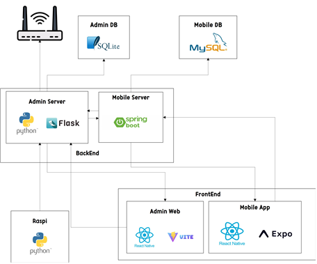

# VisionMate (비전메이트)

> 반도체 비전 검사 장비의 실시간 상태와 검사 결과를 모바일 환경에서 통합 모니터링하는 스마트 관리 플랫폼

## 프로젝트 소개

VisionMate는 반도체 제조 공정에서 운용되는 비전 검사 장비의 상태와 검사 결과를 실시간으로 확인할 수 있도록 개발된 통합 모니터링 시스템입니다.

기존의 반도체 검사 장비는 특정 PC 또는 관제실에서만 상태를 확인할 수 있어 엔지니어의 이동성과 즉각적인 대응에 한계가 있었습니다.

VisionMate는 모바일 환경에서 장비 상태, 검사 결과, 로그 및 이상 상황을 실시간으로 확인할 수 있도록 하여 현장 대응력과 운영 효율성을 향상시키는 것을 목표로 합니다.

본 저장소는 VisionMate 프로젝트의 **React Native 기반 모바일 애플리케이션(Mobile App)** 을 담당합니다.

---

## 프로젝트 목표 및 기대 효과

### 실시간 모니터링을 통한 생산성 향상

- 비전 검사 결과와 장비 상태를 실시간으로 확인하여 신속한 의사결정을 지원합니다.
- 공정 중 발생하는 문제를 빠르게 파악하여 생산성을 향상시킵니다.

### 모바일 기반의 효율적인 인력 운용

- 공간적 제약 없이 장비 상태를 확인할 수 있습니다.
- 소수의 관리자가 다수의 설비를 효율적으로 관리할 수 있습니다.

### 즉각적인 에러 대응을 통한 설비 가동률 향상

- 장비 이상 발생 시 실시간 알림을 제공합니다.
- 장애 상황을 신속하게 인지하고 대응하여 유휴 시간을 최소화합니다.

### 일정 관리 지원

- 작업 일정을 등록하고 관리할 수 있습니다.
- 일정 알림 기능을 통해 현장 업무 편의성을 높입니다.

---

## 시스템 아키텍처



---

## 주요 기능

### 실시간 모니터링

- 장비 상태 조회
- 검사 결과 조회
- 실시간 데이터 갱신
- 장비 가동 현황 시각화

### 이상 상황 알림

- 장비 오류 감지
- 실시간 푸시 알림
- 상세 오류 정보 제공

### 로그 관리

- 장비 로그 조회
- 기간별 로그 검색
- 로그 이력 관리

### 통계 기능

- 장비별 통계 조회
- 로그 기반 데이터 분석
- 이상 탐지 결과 시각화

### 일정 관리

- 일정 등록
- 일정 조회 및 수정
- 일정 알림 기능

---

## 통신 구조

VisionMate는 REST API와 Socket.IO를 함께 사용하는 Hybrid Architecture를 적용하였습니다.

### REST API

- 로그인 및 인증
- 장비 목록 조회
- 로그 조회
- 통계 조회
- 일정 관리
- 사용자 정보 관리

### Socket.IO

- 실시간 장비 상태 수신
- 실시간 검사 결과 수신
- 장비 이상 이벤트 수신
- 서버 연결 상태 확인
- 실시간 알림 전달

---

## 기술 스택

### Frontend

- React Native
- Expo
- TypeScript
- Expo Router
- React Navigation

### Communication

- REST API
- Socket.IO
- HTTP Polling

### Backend

- Spring Boot
- Flask

### Database

- MySQL
- SQLite

### Development Tools

- Visual Studio Code
- Android Studio
- Expo Go
- Figma

---

## 프로젝트 구조

```text
MobileApp/
├── app/              # Expo Router 기반 화면
├── assets/           # 이미지 및 정적 리소스
├── components/       # 공통 UI 컴포넌트
├── constants/        # 상수 관리
├── hooks/            # Custom Hooks
├── mock/             # Mock 데이터
├── scripts/          # 프로젝트 스크립트
├── services/         # API 및 Socket 통신
├── store/            # 전역 상태 관리
├── styles/           # 공통 스타일
├── types/            # TypeScript 타입 정의
├── android/          # Android Native 설정
└── app.json          # Expo 설정
```

---

## 개발 환경

| Category         | Technology          |
| ---------------- | ------------------- |
| OS               | Windows             |
| IDE              | Visual Studio Code  |
| Mobile Framework | React Native        |
| Runtime          | Expo                |
| Backend          | Spring Boot, Flask  |
| Database         | MySQL               |
| Network          | Local Wi-Fi Network |

---

## 실행 방법

### 실행 전 참고사항

VisionMate는 단독 애플리케이션이 아닌 통합 모니터링 시스템의 일부로 구성되어 있습니다.

실시간 데이터 조회 및 주요 기능을 정상적으로 사용하기 위해서는 아래 구성 요소가 모두 실행되어야 합니다.

1. Mock Program
2. Admin PC Server (Flask)
3. Admin PC
4. Mobile Server (Spring Boot)
5. Mobile App (본 저장소)

모든 구성 요소가 정상적으로 실행되어야 실시간 데이터 수신, 알림, 로그 조회 등의 기능을 사용할 수 있습니다.

※ Mobile App만 단독 실행할 경우 일부 화면은 정상적으로 표시될 수 있으나 서버 연동 기능은 제한될 수 있습니다.

### 저장소 복제

```bash
git clone https://github.com/HCComate/MobileApp.git
```

### 의존성 설치

```bash
npm install
```

### 프로젝트 실행

```bash
npx expo start
```

### Android 에뮬레이터 실행

Expo 실행 후 터미널에서 `a` 키를 입력하면 Android 에뮬레이터에서 앱을 실행할 수 있습니다.

또는 Expo Go를 이용하여 실행할 수 있습니다.

---

## Contributors

### 작품명

**VisionMate**

### 팀명

Team: 한성대학교 IT공과대학 컴퓨터공학부 모바일캡스톤디자인 CoMate(코메트)팀

### 지도교수

한기준 교수님

### 팀원

| 이름   | 학번    | 역할                                        |
| ------ | ------- | ------------------------------------------- |
| 김가현 | 2071171 | Back-end, DB 설계, Mobile Server            |
| 박석준 | 2071225 | Front-end, Mobile App, Admin PC             |
| 이시형 | 2071248 | Front-end, UI 설계, Mobile App, Admin PC    |
| 홍재민 | 2071297 | Full-stack, AI 모델 설계, DB 설계, Admin PC |
